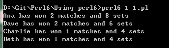

# 第二章：基础
Perl起源于一个致力于从文本文件中收集整理信息的编程语言。
现在Perl在文本处理方面仍然强大，Perl 5 是一个一般意义上的强力编程语言。
但是Perl 6更为杰出。

假设你举办了一个乒乓球联赛。
裁判告诉你比赛结果的格式：选手1 选手2 | 3:2,这意味着，选手1赢了3局，选手2赢了2局。
你需要一个脚本来，来统计选手赢了几场比赛，赢了多少局，并以此决定最终冠军的归属。

输入文件格式如下(储存在一个名为"scores"的文件中)：
```
1 Beth Ana Charlie Dave
2 Ana Dave | 3:0
3 Charlie Beth | 3:1
4 Ana Beth | 2:3
5 Dave Charlie | 3:0
6 Ana Charlie | 3:1
7 Beth Dave | 0:3
```
第一行是所有选手的名字，后面跟着的是每场比赛的结果。
这里有一个解决此问题的Perl 6 脚本：

perl_1-1
```
1 use v6;
2
3 my $file = open 'scores';
4 my @names = $file.get.words;
5
6 my %matches;
7 my %sets;
8
9 for $file.lines -> $line {
10 my ($pairing, $result) = $line.split(' | ');
11 my ($p1, $p2) = $pairing.words;
12 my ($r1, $r2) = $result.split(':');
13
14 %sets{$p1} += $r1;
15 %sets{$p2} += $r2;
16
17 if $r1 > $r2 {
18 %matches{$p1}++;
19 } else {
20 %matches{$p2}++;
21 }
22 }
23
24 my @sorted = @names.sort({ %sets{$_} }).sort({ %matches{$_} }).reverse;
25
26 for @sorted -> $n {
27 say "$n has won %matches{$n} matches and %sets{$n} sets";
28 }
```
 


